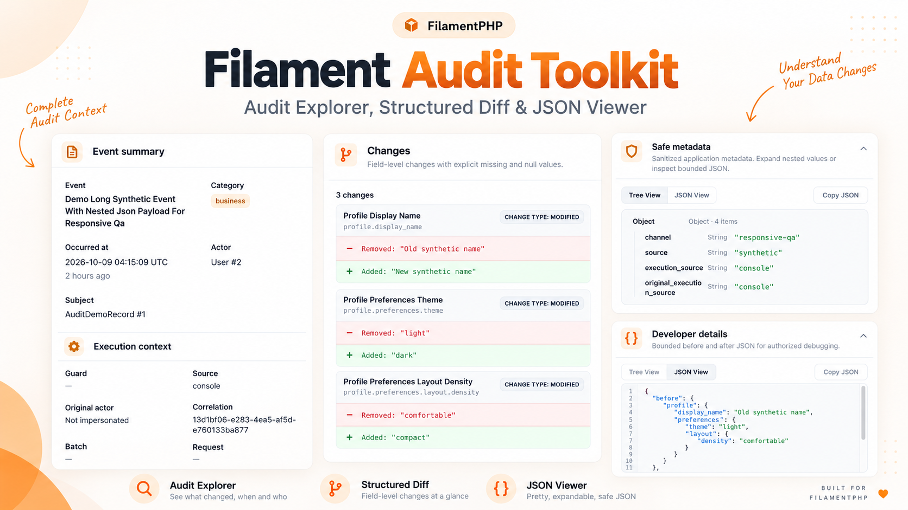
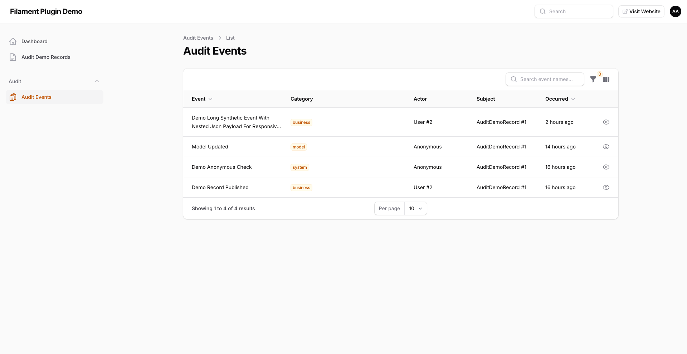
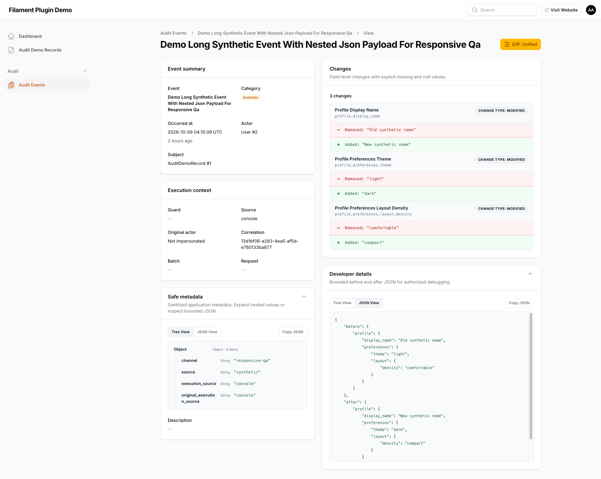

# Filament Audit Toolkit

> A read-only audit explorer for FilamentPHP with structured diffs, JSON inspection, and record history.



`digit7s/filament-audit-toolkit` adds a focused, read-only audit UI to Filament 5 applications using [`digit7s/laravel-audit-toolkit`](https://github.com/Digit7s/laravel-audit-toolkit). It does not replace the Laravel package, write audit events, or require a second audit store.

## Key Features

- Audit Explorer with search, filters, pagination, actor, subject, source, and occurrence context.
- Audit Detail with bounded structured before/after changes and developer JSON inspection.
- Reusable, subject-scoped Record History relation manager.
- Unified, Split, and Fields diff presentations.
- Structured JSON Tree View and JSON View with bounded copy support.
- Runtime diff-style switching, scoped to the current Livewire component.
- Original actor / impersonation attribution with independent authorization.
- Panel-specific, deny-by-default authorization callbacks.
- Responsive light/dark rendering using package-owned Filament CSS assets.

## Requirements

- PHP `^8.5`
- Laravel 13 and `digit7s/laravel-audit-toolkit:^0.1`
- Filament `^5.9`
- Livewire 4 through Filament

## Installation

Install the plugin and its Laravel audit engine from Packagist:

```bash
composer require digit7s/filament-audit-toolkit
```

The Laravel package owns the audit table. Publish its configuration and migrations and migrate before opening the panel:

```bash
php artisan vendor:publish --tag=audit-toolkit-config
php artisan vendor:publish --tag=audit-toolkit-migrations
php artisan migrate
```

Laravel and Filament discover both service providers automatically. Run `php artisan filament:assets` when publishing Filament assets for a deployed application.

For local package development against sibling checkouts, add path repositories in the consuming application only:

```json
{
    "repositories": [
        {"type": "path", "url": "../laravel-audit-toolkit", "options": {"symlink": true, "versions": {"digit7s/laravel-audit-toolkit": "0.1.0"}}},
        {"type": "path", "url": "../filament-audit-toolkit", "options": {"symlink": true, "versions": {"digit7s/filament-audit-toolkit": "0.1.0"}}}
    ]
}
```

This development override is intentionally not part of the published plugin manifest.

## Panel Plugin Registration

Register `FilamentAuditToolkitPlugin` explicitly in every panel that should expose the explorer:

```php
use Digit7s\FilamentAuditToolkit\FilamentAuditToolkitPlugin;

->plugin(
    FilamentAuditToolkitPlugin::make()
        ->authorization(
            viewAny: fn (?object $user): bool => $user?->can('viewAnyAuditEvents') ?? false,
            view: fn ($event, ?object $user): bool => $user?->can('viewAuditEvent') ?? false,
            viewRawValues: fn ($event, ?object $user): bool => $user?->can('viewAuditValues') ?? false,
            viewSubjectHistory: fn ($record, ?object $user): bool => $user?->can('viewAuditHistory', $record) ?? false,
            viewOriginalActor: fn ($event, ?object $user): bool => $user?->can('viewAuditImpersonation', $event) ?? false,
        ),
)
```

The plugin class is `Digit7s\FilamentAuditToolkit\FilamentAuditToolkitPlugin`. Its service provider is `Digit7s\FilamentAuditToolkit\FilamentAuditServiceProvider`.

## Authorization

Authorization is deny-by-default and is stored per registered panel. The active panel's guard supplies the callback user, so multiple panels may use different guards and policies. Navigation visibility is not authorization: resource queries, detail routes, raw-value projections, and history mounting enforce the callbacks server-side.

If `viewRawValues` is omitted, safe value presentation follows `view`. Safe values have already passed the Laravel package's storage-time privacy filtering; this plugin cannot recover excluded fields.

## Audit Explorer

`Digit7s\FilamentAuditToolkit\Resources\AuditEventResource` provides a paginated, read-only table with event-name search, event/category/date filters, actor and subject references, occurrence timestamps, and optional source, request, correlation, batch, and original-actor columns. Event names and the eye action link only to authorized detail views.



## Audit Detail

The detail page is `Digit7s\FilamentAuditToolkit\Resources\AuditEventResource\Pages\ViewAuditEvent`. It presents event summary, execution context, safe metadata, bounded field changes, and authorized developer details. Long event names wrap safely and exact timestamps are shown in UTC with relative context.



## Record History

Add `AuditHistoryRelationManager` to a resource whose model uses the core package's `Auditable` concern:

```php
use Digit7s\FilamentAuditToolkit\RelationManagers\AuditHistoryRelationManager;

public static function getRelations(): array
{
    return [AuditHistoryRelationManager::class];
}
```

The relation is polymorphic, subject-scoped, paginated, and read-only. It shows event, actor, source, timestamp, and an escaped before/after summary. It checks `viewSubjectHistory` before mounting and still requires `viewRawValues` for value display.

## Structured Diff Viewer

The `DiffBuilder` and `DiffViewerEntry` use one bounded representation with three presentations:

- `unified`: compact additions and removals with textual `+` and `−` indicators.
- `split`: responsive Before and After columns.
- `fields`: administrator-friendly cards with humanized labels and technical paths.

Nested associative values become deterministic dotted paths. Lists compare by numeric index; move detection is intentionally not attempted. Missing values are `[missing]`, explicit `null` remains `null`, and depth, entry, array-size, and display-length limits produce visible omitted/truncated markers.

## Structured JSON Viewer

Safe Metadata and authorized Developer Details use the bounded `JsonViewerBuilder`. Tree View exposes expandable object/array nodes; JSON View shows the same sanitized projection as indented syntax-highlighted JSON. Strings, numbers, booleans, `null`, empty values, and omission markers retain their type semantics. Copy JSON is available only to an authorized viewer and never includes excluded data.

## Diff Configuration and Runtime Switching

Configure global defaults in published `config/filament-audit-toolkit.php`:

```php
'diff' => [
    'default_style' => 'unified',
    'available_styles' => ['unified', 'split', 'fields'],
    'allow_style_switching' => false,
    'max_depth' => 5,
    'max_entries' => 100,
    'max_value_length' => 2000,
    'max_array_elements' => 100,
],
'json_viewer' => [
    'default_mode' => 'tree',
    'max_depth' => 5,
    'max_entries' => 200,
    'max_value_length' => 2000,
    'allow_copy' => true,
],
```

Panel-level methods on `FilamentAuditToolkitPlugin` are:

```php
FilamentAuditToolkitPlugin::make()
    ->diffStyle('split')
    ->availableDiffStyles(['unified', 'split'])
    ->allowDiffStyleSwitching();
```

Runtime selection is validated against enabled built-in styles, is component-local, and is never persisted. The Audit Detail page and Record History relation expose the native Livewire action only when switching is enabled.

## Screenshots Gallery

The repository includes three real UI captures used above:

- [Audit Explorer](art/audit-index-page.png)
- [Audit Detail](art/audit-detail-page.png)
- [Plugin preview](art/audit-thumbnail.png)

They contain synthetic labels and identifiers only; no real user data, internal URLs, credentials, or secrets. No screenshots are presented for diff styles that are not separately captured.

## Configuration

The package configuration controls navigation grouping/sort, diff styles and bounds, JSON viewer mode and bounds, and copy support. The plugin does not publish a second database configuration or migration. The Laravel core package remains the source of audit storage and privacy policy.

## Security and Read-only Behavior

The plugin provides no edit, delete, bulk-delete, clear-all, restore/revert, retention, or pruning actions. It is a read-only presentation layer for `v0.1.0`; automated retention and pruning are not available. Future releases may add controlled retention policies, dry-run cleanup, and protected event handling.

Built-in views use escaped Filament/Blade rendering and package-owned assets. Authorization callbacks must be configured for every panel. A passing test suite is not a production security certification, and database-level immutability is not guaranteed by either package.

## Troubleshooting

- If the audit table is missing, publish the core migration and run `php artisan migrate`.
- If the Explorer is forbidden, configure `viewAny` and `view` for the active panel.
- If safe or raw values are hidden, configure the appropriate callback; storage-time allowlists cannot be bypassed.
- If subject history is forbidden, configure `viewSubjectHistory` and confirm the host resource authorizes the subject.
- If assets are missing after deployment, run `php artisan filament:assets`.

## Related Laravel Core Package

The backend package is [`digit7s/laravel-audit-toolkit`](https://github.com/Digit7s/laravel-audit-toolkit). It works without Filament and provides recording, Eloquent auditing, privacy filtering, attribution context, migrations, and the `AuditQuery` contract.

## Contributing, Security and License

Run `composer validate --no-check-publish`, `composer check-platform-reqs`, `composer lint`, `composer analyse`, and `composer test` before submitting changes. See [CONTRIBUTING.md](CONTRIBUTING.md), [SECURITY.md](SECURITY.md), and [RELEASE_CHECKLIST.md](RELEASE_CHECKLIST.md).

MIT licensed. See [LICENSE](LICENSE).
